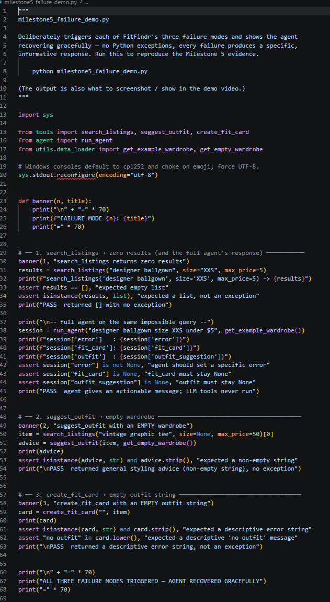
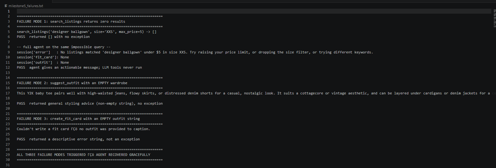

# FitFindr 🛍️

A multi-tool AI agent that helps you find secondhand pieces and figure out how to
wear them. You describe what you're after in plain language; FitFindr searches a
mock listings dataset, styles the best match against your existing wardrobe, and
writes a shareable caption for the find — handling the messy cases (nothing found,
no wardrobe, missing data) gracefully along the way.

Built for AI201 Project 2. Full design spec lives in [`planning.md`](./planning.md).

## 🎥 Demo Video

A walkthrough of FitFindr in action — a complete interaction through all three tools,
state passing between them, and the triggered failure modes with the agent's graceful,
informative responses:

**▶️ [Watch the demo](https://share.vidyard.com/watch/iai9Y1uJqUWdGLYMoij1pC)**

## Setup

```bash
python -m venv .venv
source .venv/bin/activate
pip install -r requirements.txt
echo "GROQ_API_KEY=your_key_here" > .env   # free key at console.groq.com
```

Run the app:

```bash
python app.py     # then open the URL printed in your terminal
```

Run the tests:

```bash
pytest tests/ -v
```

---

## Tool Inventory

All three tools live in [`tools.py`](./tools.py). Signatures here match the code exactly.

### 1. `search_listings(description: str, size: str | None = None, max_price: float | None = None) -> list[dict]`

- **Inputs:**
  - `description` (str): free-text keywords, e.g. `"vintage graphic tee"`.
  - `size` (str | None): requested size, e.g. `"M"`; `None` skips size filtering.
  - `max_price` (float | None): inclusive price ceiling; `None` skips price filtering.
- **Returns:** a `list[dict]` of full listing dicts (`id, title, description, category,
  style_tags, size, condition, price, colors, brand, platform`), sorted by relevance
  (best match first). Empty list `[]` if nothing matches.
- **Purpose:** find candidate items. Filters by price and size, then ranks what's left
  by how many description keywords appear in each listing's title + description + tags.

### 2. `suggest_outfit(new_item: dict, wardrobe: dict, style_profile: dict | None = None, trends: list | None = None) -> str`

- **Inputs:**
  - `new_item` (dict): a listing dict (the selected item from search).
  - `wardrobe` (dict): a wardrobe with an `"items"` list (each: `id, name, category,
    colors, style_tags, notes`); may be empty.
  - `style_profile` (dict | None) *(stretch)*: remembered preferences, e.g.
    `{"preferred_styles": ["y2k", "streetwear"]}`; `None` skips preference biasing.
  - `trends` (list | None) *(stretch)*: currently-trending style tags to lean the
    outfit toward; `None` skips trend biasing.
- **Returns:** a non-empty `str` with 1–2 outfit ideas. With a real wardrobe it names
  specific owned pieces; with an empty wardrobe it gives general styling advice.
- **Purpose:** turn a raw item into wearable outfit suggestions grounded in what the
  user already owns (and, via the optional stretch args, their saved style profile and
  current trends). Calls Groq `llama-3.3-70b-versatile`.

### 3. `create_fit_card(outfit: str, new_item: dict) -> str`

- **Inputs:**
  - `outfit` (str): the suggestion text from `suggest_outfit`.
  - `new_item` (dict): the selected listing dict.
- **Returns:** a `str` — a 2–4 sentence casual caption that mentions the item name,
  price, and platform. Varies between runs (LLM temperature `0.9`).
- **Purpose:** produce a shareable, OOTD-style caption for the find. Calls Groq.

### 4. `compare_price(item: dict, listings: list | None = None) -> dict` *(stretch)*

- **Inputs:** `item` (the listing to judge); `listings` (comparison pool, defaults
  to the full dataset).
- **Returns:** a dict — `verdict` ("great deal"/"fair"/"pricey"/"unknown"),
  `item_price`, `median_comparable`, `num_comparables`, and a `reasoning` string.
- **Purpose:** assess whether a price is fair vs comparable same-category listings.
  Pure logic, no LLM.

### 5. `get_trends(size: str | None = None) -> list` *(stretch)*

- **Inputs:** `size` (optional) to filter trends by size range.
- **Returns:** a `list[str]` of trending style tags (empty if the data file is
  unreadable).
- **Purpose:** surface currently-popular styles (from `data/trends.json`) to bias
  outfit suggestions toward what's trending.

---

## How the Planning Loop Works

`run_agent(query, wardrobe)` in [`agent.py`](./agent.py) runs a sequence of decisions,
each reading the `session` state and choosing the next action. It does **not** call all
three tools unconditionally — it branches on what `search_listings` returns.

1. **Parse** the query (regex) into `description`, `size`, `max_price`.
2. **Search.** Call `search_listings`. **Decision point — is the result list empty?**
   - **Empty →** set `session["error"]` to a specific message naming what to relax
     (price / size / keywords) and **return early.** `suggest_outfit` and
     `create_fit_card` are never called; `fit_card` stays `None`.
   - **Non-empty →** set `session["selected_item"] = results[0]` and continue.
3. **Suggest** an outfit from the selected item + wardrobe.
4. **Create** a fit card from the outfit + selected item.
5. **Return** the session.

So a normal query runs all three tools; an impossible query (e.g. "designer ballgown
size XXS under $5") stops after step 2. Same code, different path, driven entirely by
the search result.

## State Management

All state lives in one `session` dict (created by `_new_session()`), the single source
of truth for the interaction. The user enters the query **once**; nothing is re-entered
between tools.

| Stored | When | Read by |
|--------|------|---------|
| `parsed` (description/size/max_price) | after parsing | `search_listings` |
| `search_results` | after search | the empty-check branch |
| `selected_item` | when results non-empty (`= results[0]`) | `suggest_outfit`, then `create_fit_card` |
| `outfit_suggestion` | after `suggest_outfit` | `create_fit_card` |
| `fit_card` | after `create_fit_card` | the UI |
| `error` | only on the no-results branch | the UI (which panel to show) |

**Key hand-off:** the exact dict `search_results[0]` is stored as `selected_item` and
passed into *both* `suggest_outfit` and `create_fit_card` — verifiable by printing
`session["selected_item"]["id"]`, which stays the same id across all three tools.

## Error Handling

| Tool | Failure mode | What the agent does | Tested example |
|------|--------------|---------------------|----------------|
| `search_listings` | no matches | returns `[]`; loop sets a specific error and stops | `search_listings("designer ballgown", "XXS", 5)` → `[]`; agent says *"No listings matched 'designer ballgown' under $5 in size XXS. Try raising your price limit, or dropping the size filter, or trying different keywords."* |
| `suggest_outfit` | empty wardrobe | returns general styling advice instead of crashing | `suggest_outfit(item, get_empty_wardrobe())` → general advice paragraph for the item |
| `create_fit_card` | empty/missing outfit | returns a descriptive error string | `create_fit_card("", item)` → *"Couldn't write a fit card — no outfit was provided to caption."* |
| `suggest_outfit` / `create_fit_card` | LLM/API call fails | catches the exception, returns a plain fallback string so the agent stays useful | simulated in tests via a mocked client that raises |

All four are covered by `tests/test_tools.py` (12 tests, run offline by mocking the
Groq client).

### Triggered Failure Tests (Milestone 5)

Beyond the unit tests, I *deliberately* triggered each failure mode end-to-end to prove
the agent recovers gracefully — a real exception in any of these would crash the app.
These triggered failures are shown live in the
[demo video](https://share.vidyard.com/watch/iai9Y1uJqUWdGLYMoij1pC).
`milestone5_failure_demo.py` reproduces all three; run it with:

```powershell
.\.venv\Scripts\python.exe milestone5_failure_demo.py
```

**The demo script** ([`milestone5_failure_demo.py`](./milestone5_failure_demo.py)) imports
the three tools plus the full `run_agent` loop, then forces each failure in turn:



**The captured output** ([`milestone5_failures.txt`](./milestone5_failures.txt)) shows each
failure producing a specific, informative response instead of a traceback:



What each triggered "error" actually is — and why it is *handled*, not a crash:

1. **`search_listings` returns zero results** (`search_listings('designer ballgown',
   size='XXS', max_price=5)`). There is no such item, so the function returns an empty
   list `[]` — **not** an exception. The full agent then hits its decision point, sees the
   empty list, sets `session['error']` to an *actionable* message ("...Try raising your
   price limit, or dropping the size filter, or trying different keywords.") and **returns
   early**. The output confirms `fit_card` and `outfit` stay `None` — proof the LLM tools
   are never called on a dead-end query (no wasted API calls, no crash).
2. **`suggest_outfit` with an empty wardrobe** (`suggest_outfit(item, get_empty_wardrobe())`).
   With no owned pieces to name, a naive implementation would crash or return `""`. Instead
   the tool detects the empty `wardrobe['items']` and switches to a *general styling advice*
   prompt, returning the non-empty paragraph shown in the output.
3. **`create_fit_card` with an empty outfit string** (`create_fit_card('', item)`). The tool
   guards an empty/whitespace `outfit` up front and returns the descriptive string
   *"Couldn't write a fit card — no outfit was provided to caption."* — short-circuiting
   before any LLM call rather than raising.

Each block ends in a `PASS` line; the run finishes with
`ALL THREE FAILURE MODES TRIGGERED — AGENT RECOVERED GRACEFULLY`. So these are not bugs in
the app — they are the failure paths firing exactly as designed.

## Spec Reflection

- **One way the spec helped:** writing every tool's inputs/return/failure mode in
  `planning.md` *before* coding made implementation almost mechanical — the planning-loop
  pseudocode (parse → search → empty-check early return → select → suggest → card)
  translated line-for-line into `run_agent()`.
- **One divergence:** the spec assumed keyword matching would be clean, but testing
  showed that because search uses substring matching, filler words like "in" and "a"
  matched *inside* words like "v**in**tage" and "denim", polluting the ranking. I added
  stopword stripping to the query parser — a step that wasn't in the original spec — to
  fix it.
- **A second divergence, caught by testing the exact walkthrough query:** running my own
  planning.md example — *"I'm looking for a vintage graphic tee under $30, size M."* —
  exposed two parser bugs the spec never anticipated. The size regex `[A-Za-z0-9.]+`
  greedily captured the trailing period (`"size M."` → `"M."`), so the size filter
  matched *nothing*, wiped out every tee, and ranked a leather belt first. And the
  contraction `"i'm"` leaked into the search description as noise. I fixed the parser to
  strip trailing punctuation from the size (while preserving decimal sizes like `8.5`)
  and added `"i'm"` to the stopword set. Lesson: a clean unit test (`"...under $30"`)
  passed, but the *real* user phrasing — punctuation and contractions and all — is what
  broke it.

## Stretch Features

1. **Retry with fallback (+1).** When `search_listings` returns nothing, the
   planning loop automatically retries with the size filter dropped (then the
   price filter), records what it loosened in `session["retry_note"]`, and shows
   the user that note. The error path only triggers if the retry *also* fails.
2. **Price comparison tool (+2).** `compare_price` (Tool 4) judges the selected
   item's price against same-category listings (median + range) and returns a
   verdict with reasoning. The loop attaches it as `price_assessment`, shown in
   the listing panel — e.g. *"Compared to 14 other tops listings (median $22…),
   this $18 is a great deal."*
3. **Style profile memory (+2).** `style_memory.py` persists the user's
   `preferred_styles` to `style_profile.json` on disk. Each run loads the prefs
   saved by previous sessions (no re-entry) and feeds them into `suggest_outfit`,
   then folds the newly-selected item's tags back into the profile. This is
   long-term memory: a second session styles toward what the first one learned.
4. **Trend awareness tool (+2).** `get_trends` (Tool 5) reads a mock trending-tags
   dataset (`data/trends.json`, standing in for a fashion platform's trend feed).
   The loop passes current trends into `suggest_outfit`, which visibly leans the
   outfit toward any that fit (e.g. calling out "the current Y2K revival").

## AI Usage

I worked with Claude (in Claude Code) as a pair-programming and brainstorming partner.

1. **Building the tools.** I had Claude implement each tool one at a time from my
   `planning.md` specs, and I tested each in isolation before moving on. I made the
   design calls — token-based size matching that still keeps "One Size" items, and
   mocking the Groq client in the test suite so tests run offline instead of hitting the
   real API — and reviewed each function against my spec (especially the failure
   branches) before keeping it.
2. **Wiring the planning loop.** We implemented `run_agent()` together from my loop and
   state-management spec. I chose regex over an LLM for query parsing. While testing I
   noticed filler words were skewing the search ranking, and I directed the fix (strip
   stopwords during parsing) rather than accepting the first version.
3. **Verifying state flow under the real walkthrough query.** I had Claude build a
   throwaway harness that wrapped all three tools in spies and asserted, by object
   *identity* (`is`, not `==`), that the same `selected_item` dict and the same
   `outfit_suggestion` string flowed between tools with no re-entry. Running it against
   my planning.md example query surfaced the size-parse bug above (the agent selected a
   belt instead of a tee). I directed the parser fix, re-ran the harness until every
   identity assertion passed, then confirmed the existing 23-test suite still passed —
   rather than trusting that the loop "looked right."
