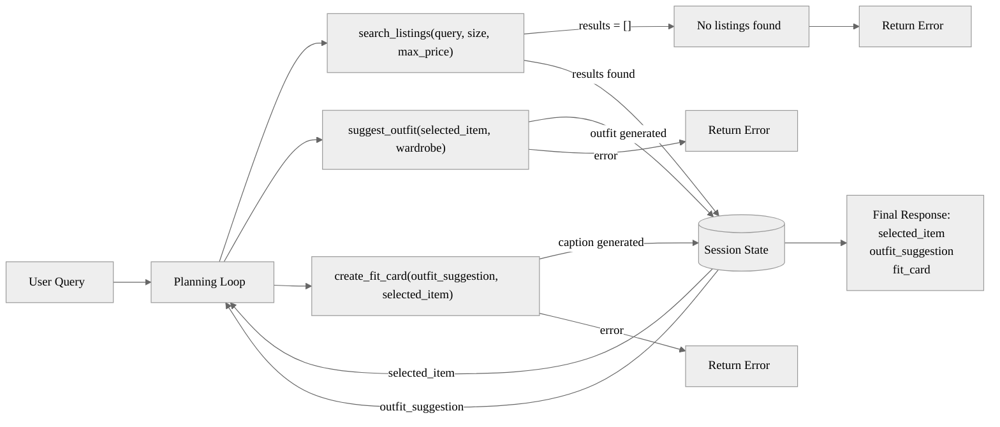

# FitFindr — planning.md

> Complete this document before writing any implementation code.
> Your spec and agent diagram are what you'll use to direct AI tools (Claude, Copilot, etc.) to generate your implementation — the more specific they are, the more useful the generated code will be.
> Your planning.md will be reviewed as part of your submission.
> Update it before starting any stretch features.

---

## Tools

List every tool your agent will use. For each tool, fill in all four fields.
You must have at least 3 tools. The three required tools are listed — add any additional tools below them.

### Tool 1: search_listings

**What it does:**
Searches the 40-item mock listings dataset and returns the items that match the
user's request, ranked best-first by keyword relevance. It applies the price and
size filters first, then scores what's left by keyword overlap.

**Input parameters:**
- `description` (str): free-text keywords describing the wanted item, e.g.
  `"vintage graphic tee"`. Split into lowercase keywords for matching.
- `size` (str | None): requested size, e.g. `"M"`. `None` skips size filtering.
- `max_price` (float | None): inclusive price ceiling. `None` skips price filtering.

**Matching logic:**
1. **Price filter:** keep listings where `price <= max_price` (skip if `None`).
2. **Size filter (token-based, case-insensitive):** uppercase both sides; split
   the listing's `size` on `/` (so `"S/M"` → `{S, M}`); keep the listing if the
   requested size equals any token, OR the listing size contains `"ONE SIZE"`.
   Skip this filter if `size is None`.
3. **Relevance score:** for each surviving listing, count how many of the
   description keywords appear in its `title` + `description` + `style_tags`
   (combined, lowercased). That count is the score.
4. Drop listings with score 0. Sort the rest by score, highest first.

**What it returns:**
A `list[dict]` of full listing dicts (fields: `id, title, description, category,
style_tags, size, condition, price, colors, brand, platform`), sorted by
relevance score descending. Returns an empty list `[]` if nothing matches —
never raises.

**What happens if it fails or returns nothing:**
Returns `[]`. The planning loop detects the empty list, sets a helpful error
message in the session (telling the user what to relax — price, size, or
keywords), and returns early **without** calling `suggest_outfit`.

---

### Tool 2: suggest_outfit

**What it does:**
Given the thrifted item and the user's existing wardrobe, asks the LLM (Groq
`llama-3.3-70b-versatile`) to suggest 1–2 complete outfits. When the wardrobe has
items, the outfits name specific pieces from it; when it's empty, it returns
general styling advice for the item instead.

**Input parameters:**
- `new_item` (dict): a listing dict from `search_listings` (the selected item).
  The prompt uses its `title`, `category`, `style_tags`, `colors`, `condition`.
- `wardrobe` (dict): a wardrobe dict with an `"items"` key → `list[dict]`, each
  item having `id, name, category, colors, style_tags, notes`. May be empty.

**Logic (two branches):**
1. If `wardrobe["items"]` is empty → build a prompt asking the LLM for **general
   styling advice**: what kinds of pieces pair well with this item, what vibe it
   suits, how to wear it. (Empty-wardrobe failure mode — never crashes.)
2. If `wardrobe["items"]` is non-empty → format the wardrobe items (name + notes)
   into the prompt and ask the LLM to suggest 1–2 outfits that **name specific
   pieces from the wardrobe** alongside the new item.

**What it returns:**
A non-empty `str` of 1–2 concrete outfit suggestions in plain language (e.g.
"Pair this with your baggy dark-wash jeans and chunky sneakers for a 90s look…").
Always returns usable text — never an empty string.

**What happens if it fails or returns nothing:**
- Empty wardrobe → general styling advice (branch 1 above), not an error.
- If the LLM call itself fails (network/API error) → catch the exception and
  return a plain fallback string (e.g. a generic styling tip for the item's
  category) so the agent stays useful rather than crashing.

---

### Tool 3: create_fit_card

**What it does:**
Turns the outfit suggestion + the thrifted item into a short, casual, shareable
caption — the kind of thing you'd post under an OOTD photo. Calls the LLM at a
higher temperature so the same input can produce fresh wording each time.

**Input parameters:**
- `outfit` (str): the outfit suggestion text returned by `suggest_outfit`.
- `new_item` (dict): the selected listing dict. The prompt uses its `title`,
  `price`, and `platform` so the caption can mention them naturally.

**Logic:**
1. **Guard:** if `outfit` is empty or whitespace-only → return a descriptive
   error string (e.g. "Couldn't write a fit card — no outfit was provided.")
   instead of calling the LLM. (Failure mode — never raises.)
2. Otherwise build a prompt giving the LLM the item details + outfit, asking for
   a 2–4 sentence caption that feels like a real post (not a product
   description), mentions the item name, price, and platform once each, and
   captures the vibe. Use a higher temperature (e.g. ~0.9) for variety.

**What it returns:**
A `str`: a 2–4 sentence caption usable on Instagram/TikTok. Different inputs (and
re-runs) yield different wording.

**What happens if it fails or returns nothing:**
- Empty/whitespace `outfit` → descriptive error string (guard above).
- LLM call failure → catch and return a plain fallback caption string rather
  than crashing.

---

### Additional Tools (stretch)

#### Tool 4: compare_price (stretch +2)

**What it does:** judges whether a listing's price is fair by comparing it to
other listings in the **same category**. Pure logic, no LLM.

**Input parameters:**
- `item` (dict): the listing to evaluate.
- `listings` (list | None): comparison pool; defaults to the full dataset.

**What it returns:** a dict — `verdict` ("great deal" / "fair" / "pricey" /
"unknown"), `item_price`, `median_comparable`, `num_comparables`, and a
human-readable `reasoning` string that cites the comparable count, median, and
range. `"unknown"` when there are fewer than 2 comparables.

**Failure mode:** too few comparables → returns `verdict: "unknown"` with an
explanatory reasoning string (never raises, never guesses).

#### Tool 5: get_trends (stretch +2)

**What it does:** returns currently-trending style tags from a local mock dataset
(`data/trends.json`), standing in for a public fashion platform's trending feed.

**Input parameters:**
- `size` (str | None): optionally filter trends to those tagged for that size
  (size-specific trends only surface when that size is requested; `"all"` trends
  always surface).

**What it returns:** a `list[str]` of trending tags (empty list if the data file
is missing/corrupt — never raises).

**Failure mode:** missing/unreadable `trends.json` → returns `[]`; the agent
still produces a normal outfit, just without trend bias.

---

## Stretch Features (built — see commit history)

1. **Retry with fallback (+1):** in the planning loop, if `search_listings`
   returns nothing, retry with the size filter dropped (then the price filter),
   record a `retry_note` describing what was loosened, and surface it to the
   user. Only if the retry also fails do we set the error.
2. **Price comparison (+2):** Tool 4 `compare_price`; the loop attaches a
   `price_assessment` to the selected item, shown in the listing panel.
3. **Style profile memory (+2):** `style_memory.py` persists `preferred_styles`
   to `style_profile.json`. The loop loads prior-session prefs (no re-entry),
   feeds them into `suggest_outfit`, then folds the new item's tags back in.
4. **Trend awareness (+2):** Tool 5 `get_trends`; the loop passes current trends
   into `suggest_outfit`, which leans the outfit toward any that fit.

---

## Planning Loop

**How does your agent decide which tool to call next?**

The loop runs as a sequence of decisions, each one reading the current `session`
state and choosing the next action. The agent does **not** call all three tools
unconditionally — the no-results branch terminates early.

1. **Parse** the query into `description`, `size`, `max_price`; store in
   `session["parsed"]`. (Missing size/price → `None`, which means "don't
   filter on it" — not an error.) **Parsing is done with regex** (`_parse_query`
   in agent.py): `max_price` from patterns like "under $30"/"$30", `size` from
   "size M", and `description` = the remaining text with price/size phrases and
   common stopwords ("looking", "for", "a", "in"…) stripped — chosen over an LLM
   parse because it's free, instant, deterministic, and the queries are simple.

2. **Call `search_listings`** with the parsed params; store the list in
   `session["search_results"]`. **Decision point — check `len(search_results)`:**
   - **If empty (`== []`):** set `session["error"]` to a specific, actionable
     message (tells the user which constraint to relax — price, size, or
     keywords) and **`return` the session immediately. Do NOT call
     `suggest_outfit` or `create_fit_card`.** `fit_card` stays `None`.
   - **If non-empty:** set `session["selected_item"] = search_results[0]`
     (the top-ranked item) and continue.

3. **Call `suggest_outfit(selected_item, wardrobe)`**; store the returned string
   in `session["outfit_suggestion"]`. This tool internally branches on whether
   the wardrobe is empty, but from the loop's view it always returns usable text.

4. **Call `create_fit_card(outfit_suggestion, selected_item)`**; store in
   `session["fit_card"]`. (`create_fit_card` guards an empty/missing outfit
   itself, so the loop doesn't need a separate check here.)

5. **Return** the completed `session`.

**What makes it adaptive:** for a normal query all three tools run; for an
impossible query (e.g. "designer ballgown size XXS under $5") the loop stops
after step 2 with an error and never reaches steps 3–4. Same code, different
path, driven entirely by what `search_listings` returned.

**How it knows it's done:** either it hit the early-return error branch, or it
completed step 4 with a `fit_card` set. `session["error"]` being `None` vs set
distinguishes the two outcomes for the caller (app.py).

---

## State Management

**How does information from one tool get passed to the next?**

All state lives in a single `session` dict created by `_new_session()` at the
start of `run_agent()`. It is the single source of truth for the interaction —
each tool's output is written into it, and the next tool reads its input from it.
The user enters the query **once**; nothing is re-entered between tool calls.

**What is stored, and when:**

| Field | Written when | Read by |
|-------|-------------|---------|
| `query` | session created | the parse step |
| `parsed` (`description`, `size`, `max_price`) | after parsing the query | `search_listings` |
| `search_results` (`list[dict]`) | after `search_listings` returns | the empty-check decision |
| `selected_item` (`dict`) | when results are non-empty (`= search_results[0]`) | `suggest_outfit`, then `create_fit_card` |
| `wardrobe` (`dict`) | session created (from UI choice) | `suggest_outfit` |
| `outfit_suggestion` (`str`) | after `suggest_outfit` returns | `create_fit_card` |
| `fit_card` (`str`) | after `create_fit_card` returns | returned to the UI |
| `error` (`str` or `None`) | only on the no-results branch | app.py, to pick which panel to show |

**The key hand-offs (no re-entry):**
- The **exact dict** `search_results[0]` is stored as `selected_item` and passed
  into `suggest_outfit(selected_item, ...)` **and** `create_fit_card(..., selected_item)`.
  It's the same object both times — the user never re-types the item.
- The **string** returned by `suggest_outfit` is stored as `outfit_suggestion`
  and passed straight into `create_fit_card(outfit_suggestion, ...)`.

This is verifiable: printing `session["selected_item"]["id"]` after each step
shows the same id flowing through all three tools.

---

## Error Handling

For each tool, describe the specific failure mode you're handling and what the agent does in response.

| Tool | Failure mode | Agent response |
|------|-------------|----------------|
| search_listings | No results match the query | Returns `[]`. The loop sets `session["error"]` to a specific message naming what to relax ("No listings matched 'designer ballgown' under $5 in size XXS — try raising the price, dropping the size filter, or different keywords."), returns early, and never calls the later tools. |
| suggest_outfit | Wardrobe is empty | Detects `wardrobe["items"] == []` and returns **general styling advice** for the item instead of crashing or returning "". The loop continues normally. |
| create_fit_card | Outfit input is missing or incomplete | Guards an empty/whitespace `outfit` and returns a descriptive error string ("Couldn't write a fit card — no outfit was provided.") rather than raising. |
| suggest_outfit / create_fit_card | LLM/API call fails (network, rate limit) | The tool catches the exception and returns a plain fallback string (a generic styling tip / simple caption) so the agent stays useful instead of crashing. |

---

## Architecture

---

## AI Tool Plan

<!-- For each part of the implementation below, describe:
     - Which AI tool you plan to use (Claude, Copilot, ChatGPT, etc.)
     - What you'll give it as input (which sections of this planning.md, your agent diagram)
     - What you expect it to produce
     - How you'll verify the output matches your spec before moving on

     "I'll use AI to help me code" is not a plan.
     "I'll give Claude my Tool 1 spec (inputs, return value, failure mode) and ask it to implement
     search_listings() using load_listings() from the data loader — then test it against 3 queries
     before trusting it" is a plan. -->

**Tool used:** Claude (in Claude Code), working as a pair-programming and
brainstorming partner alongside me.

**Milestone 3 — Individual tool implementations:**
I pair with Claude one tool at a time. I give it the relevant Tool block from
this planning.md (its inputs, matching/branch logic, return value, and failure
mode) and we brainstorm the implementation together in `tools.py`, using
`load_listings()` from the data loader. I read each function as we go — checking
the parameters match what I specced and the failure mode is actually handled —
and we revise anything that doesn't match before running it. Then I try it on a
few example queries to see real output.

**Milestone 4 — Planning loop and state management:**
I share the Planning Loop, State Management, and Architecture sections of this
planning.md with Claude, and we work through `run_agent()` together. We talk
through each decision point — especially the empty-results branch and how the
`session` dict carries `selected_item` and `outfit_suggestion` between tools —
and I review the generated loop to confirm it branches on the search result and
doesn't just call all three tools in a fixed order before we keep it.

---

## A Complete Interaction (Step by Step)

Write out what a full user interaction looks like from start to finish — tool call by tool call. Use a specific example query.

**User:** "I'm looking for a vintage graphic tee under $30, size M. I mostly wear baggy jeans and chunky sneakers."

1. FitFindr calls `search_listings("vintage graphic tee", size="M", max_price=30.0)` and retrieves matching listings sorted by relevance. The top result is selected: "Faded Band Tee — $22, Depop, Good condition."

2. FitFindr passes the selected item into `suggest_outfit(new_item=<band tee>, wardrobe=<user_wardrobe>)`, which returns styling guidance such as pairing it with baggy jeans and chunky sneakers for a 90s-inspired look.

3. FitFindr then calls `create_fit_card(outfit=<suggestion>, new_item=<band tee>)` to generate a shareable caption like: "thrifted this faded band tee off depop for $22 and it was made for my baggy jeans 🖤"

If `search_listings` returns no results, the process stops immediately and no further tools are called. The user is prompted to adjust their filters or try a different search.
